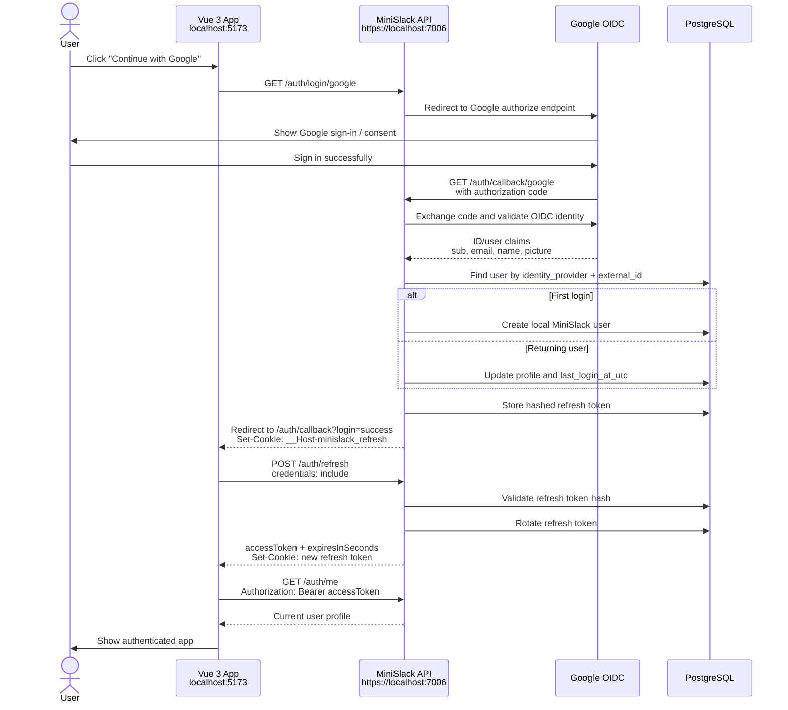
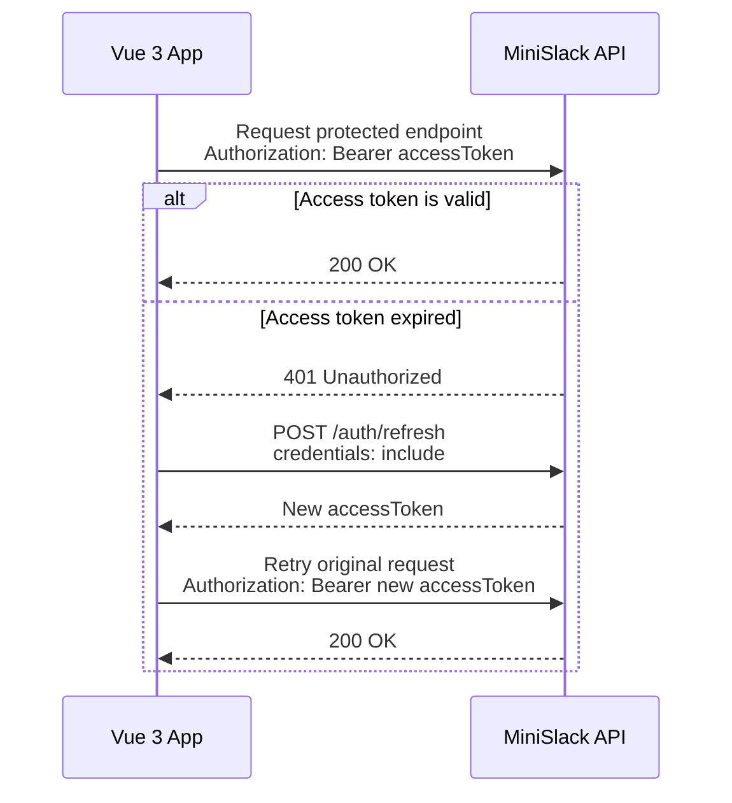
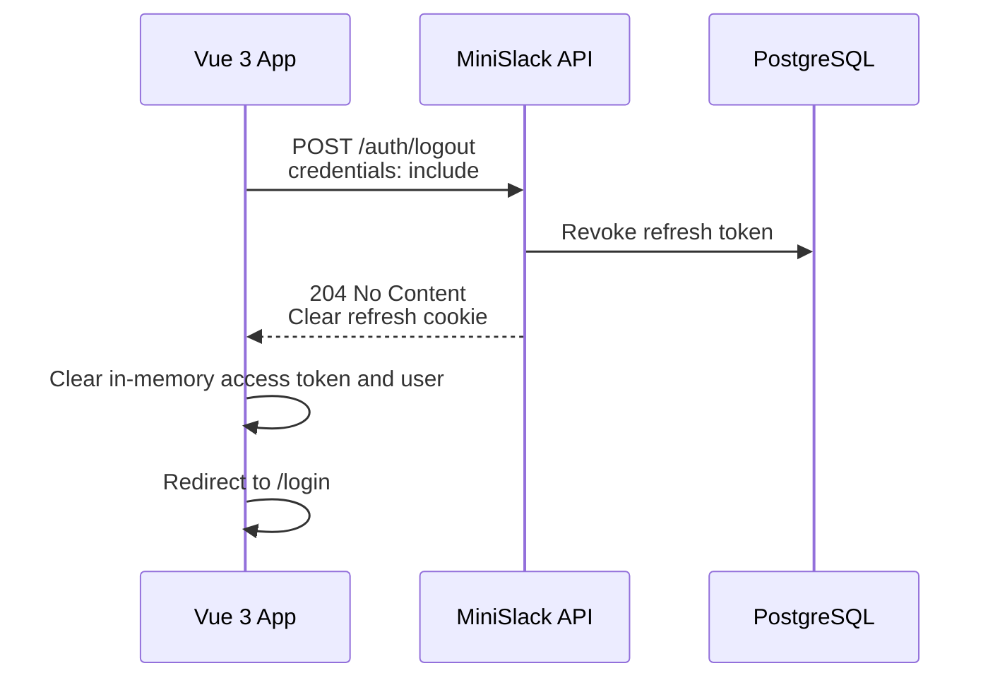

# MiniSlack Authentication Flow

MiniSlack uses Google OpenID Connect to verify the user's identity, then issues its own API tokens.

The browser keeps the long-lived refresh token in an `HttpOnly` cookie. Vue keeps the short-lived access token only in memory.

## Login Sequence



## Request Flow After Login



## Logout Flow



## Token Storage

| Token | Stored In | Lifetime | Purpose |
| --- | --- | --- | --- |
| Google OIDC code/token | API only during callback | Very short | Verify Google identity |
| MiniSlack access token | Vue memory only | Short, e.g. 15 minutes | Authorize API calls |
| MiniSlack refresh token | `HttpOnly`, `Secure`, `SameSite=None`, `Path=/` cookie | Longer, e.g. 30 days | Get new access tokens |
| Refresh token hash | PostgreSQL | Until expiry/revocation | Validate refresh requests |

## Important Cookie Details

The refresh cookie is named:

```text
__Host-minislack_refresh
```

Because it uses the `__Host-` prefix, the cookie must be:

```text
Secure
Path=/
No Domain attribute
```

Because Vue runs on `http://localhost:5173` and the API runs on `https://localhost:7006`, refresh requests are cross-origin. The cookie also needs:

```text
SameSite=None
```

Vue must call refresh/logout endpoints with:

```ts
credentials: 'include'
```

## Why `/auth/refresh` Exists

The Google login callback does not send the access token in the URL. Instead:

1. The API sets the refresh cookie.
2. Vue lands on `/auth/callback?login=success`.
3. Vue calls `/auth/refresh`.
4. The API returns a short-lived access token.

This avoids putting tokens in browser history, logs, or referrer headers.

